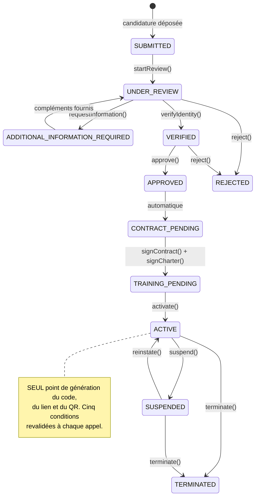

# Module Ambassadeurs — étude d'architecture

> **Statut : étude soumise à validation. Aucune ligne de code n'a été écrite pour
> ce chantier.**
> Date : 2026-08-02.

---

## Avertissement préalable : ce module existe déjà à 70 %

L'étude demandée porte sur un module **partiellement construit**. Le présenter
comme un chantier neuf reviendrait à proposer de reconstruire du code qui
fonctionne et qui est couvert par 96 tests.

| | |
|---|---:|
| Code existant | 4 329 lignes |
| Modèles Prisma | 12 |
| Énumérations | 9 |
| Routes exposées | 26 |
| Tests | **96, tous au vert** |
| Types de notification | 12 |

**Ce qui existe et fonctionne** : le cycle de vie en 11 statuts avec activation
différée du code, le moteur de commissions branché sur les paiements confirmés, le
portefeuille d'entreprises avec péremption à 12 mois, le portefeuille-monnaie et
les versements, la politique par pays, les écrans mobiles.

**Ce qui manque** : la candidature en libre-service, les pièces d'identité, la
formation et le quiz comme objets réels, le QR code et le lien personnel, la
distinction indépendant / institutionnel.

L'étude porte donc sur **cinq compléments et huit risques**, pas sur une refonte.

---

## 1. Le cycle de vie demandé, confronté à l'existant

| # | Étape demandée | État | Écart |
|---|---|---|---|
| 1 | Candidature pour devenir ambassadeur | 🟠 | Existe, mais **réservée à un ADMIN** (`create(adminUserId, dto)`). Aucun parcours en libre-service. |
| 2 | Dépôt des pièces d'identité | 🔴 | **Absent.** Aucun rattachement documentaire. |
| 3 | Vérification d'identité | 🟠 | `verifyIdentity()` existe, mais **déclaratif** : il n'y a rien à vérifier. |
| 4 | Demande de compléments | 🟢 | `requestInformation()` + statut dédié. |
| 5 | Validation administrative | 🟢 | `approve()` → `CONTRACT_PENDING`, jamais `ACTIVE`. |
| 6 | Signature de la charte | 🟢 | `signCharter()`. |
| 7 | Signature du contrat | 🟢 | `signContract()` → `TRAINING_PENDING`. |
| 8 | Formation obligatoire | 🟠 | `trainingCompletedAt` seul. **Aucun contenu, aucun suivi.** |
| 9 | Quiz | 🟠 | `quizScore Int?` seul. **Aucune question, aucun barème, aucun seuil.** |
| 10 | Activation officielle | 🟢 | `activate()` revalide **les cinq conditions**. |
| 11 | Génération du code | 🟢 | À l'activation uniquement. |
| 12 | **Génération du QR Code** | 🔴 | **Absent.** |
| 13 | **Génération du lien personnel** | 🔴 | **Absent.** |
| 14 | Tableau de bord | 🟢 | Écrans mobiles livrés. |
| 15 | Portefeuille d'entreprises | 🟢 | Avec alertes 9 / 11 / 12 mois. |
| 16 | Commissions | 🟢 | Moteur branché sur webhook de paiement. |
| 17 | Paiements | 🟢 | Demande → validation → exécution. |
| 18–20 | Suspension / réactivation / résiliation | 🟢 | Complets. |

**Votre règle cardinale est déjà tenue** : `Ambassador.code` est `String? @unique`
— nullable. Un code qui n'existe pas ne peut ni fuiter, ni être distribué, ni être
accepté. `activate()` revalide identité, approbation, contrat, charte et
formation ; `resolveActiveAmbassadorByCode()` refuse tout statut autre qu'`ACTIVE`.
**Deux couches, testées sur les dix statuts non actifs.**

---

## 2. Entités

### Existantes (12)

| Entité | Rôle | Remarque |
|---|---|---|
| `Ambassador` | Le dossier et son statut | 11 statuts, portes d'activation |
| `AmbassadorEvent` | Journal des décisions | **Moins riche que `PartnershipEvent`** — voir §9 |
| `AmbassadorReferral` | Attribution d'un filleul | Source tracée |
| `AmbassadorPortfolioEntry` | Entreprise du portefeuille | Péremption 12 mois |
| `PortfolioEvent` | Journal du portefeuille | |
| `CommissionRule` | Barème | Taux en points de base |
| `Commission` | Commission due | `paymentId @unique` |
| `CommissionEvent` | Journal des commissions | |
| `AmbassadorWallet` | Solde — **cache de lecture** | |
| `WalletTransaction` | **Vérité comptable**, en ajout | Grand livre |
| `PayoutRequest` | Demande de versement | |
| `AmbassadorPolicy` | Règles par pays | Politique de repli |

### À créer (5)

| Entité | Rôle | Justification |
|---|---|---|
| `AmbassadorApplication` **ou** extension d'`Ambassador` | Candidature en libre-service | Voir l'arbitrage §3 |
| `AmbassadorDocument` | Pièces d'identité | Rattachement au coffre-fort |
| `TrainingModule` + `TrainingProgress` | Formation réelle | Contenu, suivi, reprise |
| `QuizQuestion` + `QuizAttempt` | Quiz réel | Barème, seuil, tentatives |
| `AmbassadorReferralLink` | Lien personnel et QR | Voir §7 |

---

## 3. Premier arbitrage à rendre : candidature séparée ou dossier unique ?

C'est la décision structurante de ce chantier. Les deux options sont défendables.

### Option A — `Ambassador` porte la candidature dès le départ

Le candidat crée directement une ligne `Ambassador` au statut `SUBMITTED`.

**Pour** : c'est l'existant, aucune migration de données ; un seul identifiant tout
au long du parcours ; le journal couvre le dossier de bout en bout.

**Contre** : la table `Ambassador` porte des lignes qui ne sont pas des
ambassadeurs. Chaque requête de comptage, chaque tableau de bord, chaque calcul
financier doit penser à filtrer sur le statut. **C'est exactement le piège du
partenariat** : nous avons dû, à trois reprises, retrouver les endroits où un
statut n'était pas filtré.

### Option B — `AmbassadorApplication` distincte

La candidature vit dans sa propre table ; l'`Ambassador` naît **à l'activation**.

**Pour** : « ambassadeur » redevient un mot qui veut dire quelque chose. Aucun
filtrage défensif. La suppression d'une candidature refusée n'effleure pas les
données financières.

**Contre** : deux identifiants, une bascule à écrire, et le journal se scinde en
deux. **Migration des dossiers existants nécessaire.**

### Recommandation

**Option A, mais avec une vue nommée.** L'existant fonctionne, il est testé, et la
bascule d'Option B introduirait un risque disproportionné pour un bénéfice
d'élégance.

Le piège de l'option A se neutralise par une constante partagée, sur le modèle de
`DECIDABLE_STATUSES` du module Partenariats :

```ts
// Un ambassadeur au sens économique du terme. Toute statistique, tout calcul
// financier et tout export part de cette liste — jamais d'un filtre réécrit.
export const OPERATIONAL_STATUSES = [ACTIVE, SUSPENDED] as const;
export const APPLICATION_STATUSES = [SUBMITTED, UNDER_REVIEW, ...] as const;
```

**Décision attendue de votre part.**

---

## 4. États et transitions

Les 11 statuts validés le 2026-08-02 sont conservés. Aucun ajout n'est nécessaire.



### Les cinq portes de l'activation

```
identityVerifiedAt · approvedAt · contractSignedAt · charterSignedAt · trainingCompletedAt
```

`activate()` les revalide **toutes**, à chaque appel, et énumère les manquantes
dans le message d'erreur. Un administrateur pressé ne peut pas court-circuiter une
étape.

> **Deux transitions à ajouter** si l'on introduit un quiz bloquant :
> `TRAINING_PENDING → TRAINING_PENDING` (nouvelle tentative) et une sixième porte
> `quizPassedAt`. À arbitrer §6.

---

## 5. Complément 1 — candidature en libre-service

L'écart le plus visible : aujourd'hui, seul un ADMIN crée un dossier.

Le parcours mémorisé le 2026-08-02 prévoit **six étapes**, dont le principe
essentiel : *pas de diplôme exigé*.

| Étape | Contenu | Obligatoire |
|---|---|---|
| 1 | Identité et contact | ✅ |
| 2 | **Pièce d'identité** (CNI ou passeport) | ✅ |
| 3 | Photo, CV, lettre de motivation | ❌ |
| 4 | Motivation et zone d'activité | ✅ |
| 5 | Type : indépendant ou institutionnel | ✅ |
| 6 | Acceptation des conditions | ✅ |

**Points d'attention** :

- **Un mineur peut-il devenir ambassadeur ?** Question non tranchée. Le
  programme génère des revenus ; CLAUDE.md §5 impose un accord parental pour tout
  ce qui engage. Recommandation : **non**, avec seuil configurable par pays via
  `AmbassadorPolicy` — jamais une valeur codée en dur.
- **Une seule candidature par compte**, contrainte `@@unique([userId])` déjà
  présente. Une candidature refusée doit-elle pouvoir être redéposée ? Le module
  Partenariats répond oui, sur ardoise propre. Même règle recommandée.
- **Le rôle `AMBASSADEUR`** n'est attribué qu'à l'activation, jamais au dépôt.

---

## 6. Compléments 2 et 3 — pièces d'identité, formation, quiz

### Pièces d'identité

Une pièce d'identité est de niveau **« Très sensible »** (CLAUDE.md §1) :
chiffrement, journalisation, accès exceptionnel et limité.

**Elle doit donc vivre dans le coffre-fort numérique**, jamais dans une table du
module Ambassadeurs. `AmbassadorDocument` ne porte qu'un rattachement, comme
`PartnershipDocument`.

> **Même réserve que pour les partenariats** : le coffre est *personnel*. Ici cela
> tombe juste — la pièce d'identité appartient bien à la personne. C'est le seul
> cas où le coffre personnel est le bon endroit.

Analyse anti-malware avant enregistrement, empreinte pour contrôler l'intégrité,
suppression logique puis définitive.

### Formation et quiz

Aujourd'hui : une date et un entier. Ni contenu, ni progression, ni barème.

Trois niveaux d'ambition possibles :

| Niveau | Contenu | Effort | Quand |
|---|---|---|---|
| **1 — déclaratif** | L'administrateur atteste que la formation a eu lieu | *existant* | maintenant |
| **2 — suivi** | Modules, progression, reprise là où l'on s'est arrêté | moyen | lancement |
| **3 — évaluant** | Quiz avec barème, seuil, tentatives limitées | élevé | après lancement |

**Recommandation : niveau 2 au lancement, niveau 3 ensuite.** Un quiz mal calibré
bloque des ambassadeurs légitimes, et son barème ne se règle qu'avec du volume
réel. Le champ `quizScore` existe déjà : il pourra accueillir le niveau 3 sans
migration.

**Décision attendue de votre part.**

---

## 7. Complément 4 — lien personnel et QR code

Le code existe ; le lien et le QR n'existent pas.

### Ce qu'il ne faut pas faire

Générer le QR côté serveur et le stocker comme image. Un QR code est une
**représentation** d'une URL, pas une donnée : le stocker, c'est créer une copie à
maintenir, à invalider, à purger.

### Architecture proposée

```
code            : LS-AMB-XXXXXX          (déjà en base, unique, immuable)
lien personnel  : https://leststagiaires.com/r/LS-AMB-XXXXXX   (dérivé)
QR code         : rendu à l'affichage, jamais stocké           (dérivé)
```

Le lien est **dérivé du code**, exactement comme la référence de partenariat est
dérivée de l'identifiant. Aucune colonne, aucun rattrapage, aucune divergence
possible.

Le domaine public passe par une variable de configuration
(`PUBLIC_REFERRAL_BASE_URL`), jamais codé en dur — le domaine changera.

### Ce qui manque vraiment

**La route publique `/r/:code`**, qui n'existe pas. Elle doit :

1. résoudre le code via `resolveActiveAmbassadorByCode()` ;
2. **journaliser le clic**, y compris quand le code est invalide (vous l'avez
   demandé le 2026-08-01 : détecter fautes de saisie, codes obsolètes, fraudes) ;
3. rediriger vers l'inscription en pré-remplissant le code ;
4. **ne jamais révéler l'identité de l'ambassadeur** avant inscription.

> **Piège de sécurité.** Une route publique qui répond différemment selon qu'un
> code existe ou non permet d'énumérer les codes valides. Elle doit répondre
> **identiquement** dans les deux cas — redirection vers l'inscription — et ne
> signaler l'invalidité qu'**après** soumission du formulaire.

---

## 8. Risques de fraude

C'est le cœur de l'étude : ce module distribue de l'argent.

| # | Risque | Traité ? | Mécanisme |
|---|---|---|---|
| 1 | **Auto-parrainage** | 🟢 | `SELF_REFERRAL_BLOCKED`, testé |
| 2 | **Rejeu de commission** | 🟢 | `Commission.paymentId @unique` — garanti en **base**, pas en code |
| 3 | **Commission sur paiement non confirmé** | 🟢 | Le moteur ne part que du webhook |
| 4 | **Code utilisé avant activation** | 🟢 | Code nullable + garde de statut |
| 5 | **Double attribution d'un filleul** | 🟢 | `ALREADY_ATTRIBUTED` |
| 6 | **Comptes fictifs en masse** | 🔴 | **Non traité** — voir ci-dessous |
| 7 | **Collusion ambassadeur / entreprise** | 🔴 | **Non traité** |
| 8 | **Détournement de versement** | 🟠 | Partiel — voir ci-dessous |

### Risque 6 — création de comptes fictifs

Un ambassadeur crée vingt faux comptes d'entreprise, souscrit avec des paiements
minimaux, encaisse les commissions.

**Ce qui protège déjà** : l'organisation doit être `VERIFIED` par un ADMIN, et la
commission naît d'un **paiement réellement confirmé** — la fraude coûte donc de
l'argent réel au fraudeur.

**Ce qui manque** : une détection de faisceau. Recommandation, par ordre de coût
croissant :

1. **Seuil d'alerte** : plus de N attributions en M jours pour un même ambassadeur
   → notification à l'administration. Simple, efficace, à mettre au lancement.
2. **Corrélation** : mêmes IP, mêmes appareils, numéros consécutifs entre
   l'ambassadeur et ses filleuls.
3. **Délai de carence** : une commission n'est *payable* qu'après N jours sans
   remboursement. Le statut `Commission` le permet déjà.

### Risque 7 — collusion

Une entreprise et un ambassadeur s'entendent : l'entreprise souscrit via le code,
partage la commission. **Indétectable techniquement.** Se traite par le contrat et
par le contrôle a posteriori — à documenter dans la charte, pas à coder.

### Risque 8 — détournement de versement

Un ambassadeur modifie ses coordonnées de paiement juste avant un versement.

**Ce qui protège** : le versement suit demande → validation ADMIN → exécution, et
les coordonnées sont masquées dans les e-mails.

**Ce qui manque** : un **délai de refroidissement** après changement de
coordonnées — pas de versement dans les N heures suivant une modification, et
notification immédiate à l'ancien et au nouveau contact. Mécanisme classique, peu
coûteux, à mettre au lancement.

---

## 9. Mécanismes de sécurité — écarts avec le module Partenariats

Le module Partenariats a reçu, le 2026-08-02, des garanties que le module
Ambassadeurs n'a pas. **C'est l'écart le plus important de cette étude**, car il
porte sur de l'argent.

| Garantie | Partenariats | Ambassadeurs |
|---|---|---|
| Journal en **ajout seul** (déclencheur PostgreSQL) | 🟢 | 🔴 |
| Journal **survivant** à la suppression | 🟢 | 🔴 `Cascade` |
| **Trois niveaux de motif** | 🟢 | 🔴 champ libre unique |
| Audit avec **ancienne / nouvelle valeur** | 🟢 | 🔴 |
| **Visibilité** admin / intéressé | 🟢 | 🔴 |
| Notifications **enregistrées** dans le journal | 🟢 | 🔴 |

### Ce que cela signifie concrètement

- `AmbassadorEvent`, `CommissionEvent`, `PortfolioEvent` et `WalletTransaction`
  sont **modifiables et supprimables**. Un grand livre comptable modifiable n'est
  pas un grand livre.
- Le motif d'une suspension d'ambassadeur est un **champ libre** qui part dans la
  notification — exactement le défaut corrigé pour les partenariats. Une note du
  type « soupçon de fraude, à surveiller » partirait chez l'intéressé.
- Supprimer un compte efface l'historique de ses commissions.

**Recommandation : porter les quatre garanties avant tout développement
fonctionnel.** C'est une migration et un refactor de `recordEvent()` vers un
`journal()` unifié — le travail est connu, il a été fait pour les partenariats, et
il est **beaucoup moins coûteux maintenant qu'après**.

---

## 10. Rôles et permissions

| Action | Rôle |
|---|---|
| Déposer sa candidature | authentifié |
| Consulter son dossier, son portefeuille, ses commissions | `AMBASSADEUR` |
| Demander un versement | `AMBASSADEUR` actif |
| Instruire, approuver, activer, suspendre, résilier | **`ADMIN` + 2FA** |
| Valider et exécuter un versement | **`ADMIN` + 2FA** |
| Gérer les barèmes | **`ADMIN` + 2FA** |

> **Séparation à instaurer.** Aujourd'hui un même ADMIN peut **valider et
> exécuter** un versement. Sur un flux financier, la séparation des tâches est un
> principe de base : celui qui valide ne doit pas être celui qui exécute.
> Peu coûteux à ajouter maintenant, très coûteux à imposer après.

---

## 11. Notifications

12 types existent. À ajouter selon les compléments retenus :

| Type | Politique proposée |
|---|---|
| `AMBASSADOR_APPLICATION_SUBMITTED` | e-mail obligatoire (accusé de réception) |
| `AMBASSADOR_ADDITIONAL_INFORMATION_REQUIRED` | e-mail obligatoire |
| `AMBASSADOR_IDENTITY_VERIFIED` | interne seulement |
| `AMBASSADOR_TRAINING_AVAILABLE` | e-mail obligatoire |
| `AMBASSADOR_ACTIVATED` | **e-mail obligatoire** — porte le code, le lien, le QR |
| `AMBASSADOR_PAYOUT_DETAILS_CHANGED` | **e-mail obligatoire + SMS** (sécurité) |

L'activation mérite le soin le plus grand : c'est le message que l'ambassadeur
gardera, et qui porte son outil de travail.

---

## 12. Points susceptibles de poser problème à long terme

| # | Point | Pourquoi c'est un problème dans deux ans |
|---|---|---|
| 1 | **`Ambassador` mélange candidats et ambassadeurs** | Chaque nouveau tableau de bord devra penser à filtrer. §3 |
| 2 | **Journaux modifiables** | Un litige sur une commission de 2027 sera indéfendable. §9 |
| 3 | **Barème unique par pays** | Une campagne saisonnière, un taux négocié : `CommissionRule` devra porter une validité temporelle. **À prévoir maintenant dans le modèle**, même inutilisée. |
| 4 | **Solde en cache** | `AmbassadorWallet` est reconstruit depuis `WalletTransaction`. Il faut une **tâche de réconciliation** qui vérifie l'égalité et alerte en cas de divergence. Sans elle, un écart passera inaperçu des mois. |
| 5 | **Péremption à 12 mois codée** | Configurable par `AmbassadorPolicy`, mais la règle « le rattachement se renouvelle à chaque achat » est structurelle. Si vous passez un jour à un modèle différent, c'est une refonte. |
| 6 | **Pas de plafond de commission** | Aucune limite au montant qu'un ambassadeur peut accumuler. Un bogue de barème ou un paiement aberrant produirait une commission absurde. **Un plafond de sécurité** — au-delà duquel la commission part en revue manuelle — coûte dix lignes. |
| 7 | **Devise unique implicite** | Tout est en XAF. Un ambassadeur ivoirien, un paiement en NGN : le modèle porte `currency`, mais aucune conversion. À arbitrer avant expansion. |
| 8 | **Aucune fin de vie du code** | Le code d'un ambassadeur résilié cesse d'ouvrir droit à commission, mais reste dans les QR imprimés. Prévoir une page « ce code n'est plus actif » plutôt qu'une erreur. |

---

## 13. Ordre de travail proposé

Trois phases. La première ne produit **aucune fonctionnalité visible** — et c'est
volontaire.

### Phase 1 — mise à niveau des garanties *(recommandée en premier)*

1. Journaux en ajout seul + survivants, sur les quatre tables.
2. Trois niveaux de motif sur suspension, résiliation, refus.
3. `journal()` unifié : événement + audit en un seul appel.
4. Réconciliation solde ↔ grand livre.
5. Plafond de sécurité sur les commissions.

*Aucune fonctionnalité nouvelle. Mais c'est le seul moment où cela reste bon
marché.*

### Phase 2 — parcours de candidature

6. Candidature en libre-service, 6 étapes.
7. Pièces d'identité dans le coffre-fort.
8. Formation niveau 2 (modules et progression).
9. Lien personnel, QR à l'affichage, route publique `/r/:code`.
10. Séparation validation / exécution des versements.
11. Délai de refroidissement sur changement de coordonnées.

### Phase 3 — consolidation

12. Détection de faisceau de fraude (seuil d'alerte).
13. Quiz niveau 3, si le volume le justifie.
14. Documentation de gel + recette de bout en bout.

---

## 14. Décisions attendues de votre part

| # | Question | Recommandation |
|---|---|---|
| 1 | Candidature dans `Ambassador` ou table séparée ? | **Dans `Ambassador`**, avec listes de statuts nommées |
| 2 | Un mineur peut-il être ambassadeur ? | **Non**, seuil configurable par pays |
| 3 | Niveau d'ambition de la formation ? | **Niveau 2** au lancement |
| 4 | Le quiz est-il bloquant ? | **Non au lancement**, à réévaluer |
| 5 | Une candidature refusée peut-elle être redéposée ? | **Oui**, sur ardoise propre |
| 6 | Phase 1 avant les fonctionnalités ? | **Oui** — c'est le cœur de ma recommandation |
| 7 | Séparation validation / exécution des versements ? | **Oui**, dès maintenant |
| 8 | Plafond de sécurité sur les commissions ? | **Oui**, avec revue manuelle au-delà |

---

## Annexe — inventaire de l'existant

**Services** : `ambassadors`, `commissions`, `commission-rules`, `portfolio`,
`wallet`, `payouts`, `ambassador-policy`, `ambassador-sweep` (tâche planifiée).

**Tests** : 96, dont `ambassador-lifecycle.spec.ts` qui vérifie qu'aucun des dix
statuts non actifs n'est accepté par le moteur d'attribution.

**Garde-fou notable** : `commissions.service.ts` réinitialise le compteur du
portefeuille **avant** toute arbitrage de commission — « la règle porte sur
l'achat, pas sur la commission ».
