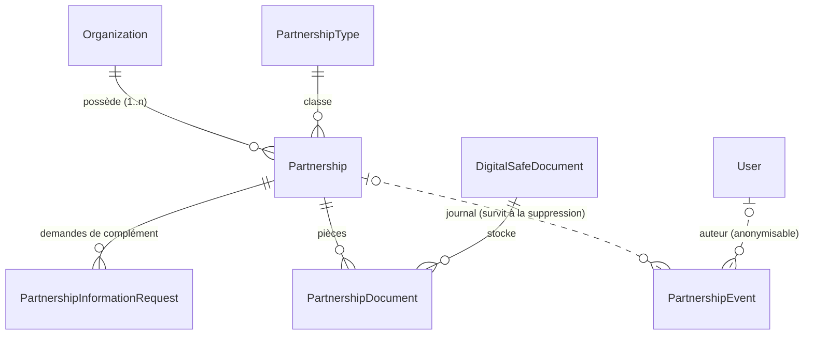
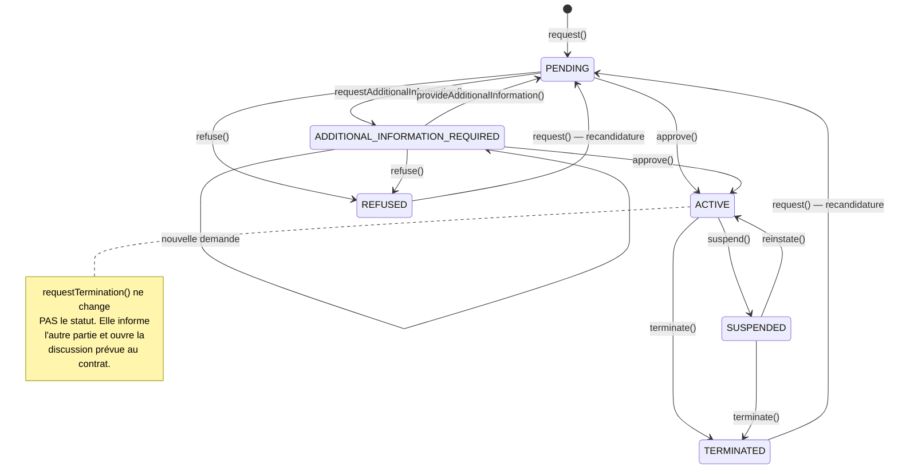

# Module Partenariats — documentation de référence

> **État : GELÉ au 2026-08-02.**
> Ce document fait foi pour tout développement ultérieur touchant au module.
> Toute évolution qui contredit une règle énoncée ici doit d'abord être arbitrée
> par le promoteur, puis reportée dans ce document.

**Périmètre.** Le programme de partenariat lie une organisation **déjà vérifiée et
titulaire d'un compte** à LES STAGIAIRES. À ne pas confondre avec le module
`partnership-requests`, qui traite les prospects entrants du formulaire public
« Nous contacter » — nom d'organisation en texte libre, aucun compte rattaché.
Deux entonnoirs distincts, deux modules distincts.

---

## 1. Décisions structurantes

Sept décisions gouvernent tout le reste. Elles sont énoncées ici parce qu'une
lecture du seul code ne les expliquerait pas.

| # | Décision | Date | Conséquence |
|---|---|---|---|
| 1 | **Un partenariat n'a pas de durée** | 2026-07-31 | Aucune date de fin calculée, aucun compte à rebours, aucune tâche planifiée ne change un statut. La durée figure au contrat signé, pas ici. |
| 2 | **Un dossier incomplet n'est pas un refus** | 2026-08-02 | Statut `ADDITIONAL_INFORMATION_REQUIRED` ; `REFUSED` réservé aux véritables décisions défavorables. |
| 3 | **Trois niveaux de motif** | 2026-08-02 | `internalNote` / `reasonCode` / `publicMessage`. Séparation **structurelle**, pas disciplinaire. |
| 4 | **Typologie configurable** | 2026-08-02 | Table `PartnershipType`, pas énumération : la liste s'étend sans migration. |
| 5 | **Plusieurs partenariats par organisation** | 2026-08-02 | L'unicité porte sur le couple *(organisation, type)*. |
| 6 | **Journaux en ajout seul** | 2026-08-02 | Déclencheurs PostgreSQL. Le journal survit à la suppression du partenariat. |
| 7 | **Aucun bouton mort dans un e-mail** | 2026-08-02 | `PARTNER_SPACE_ENABLED`, défaut fermé. |

### La règle des trois niveaux de motif

Elle mérite un développement, car c'est la seule qui protège contre un dommage
irréversible.

Avant le 2026-08-02, `dto.reason` — un champ libre de 1 000 caractères rempli par
un administrateur — partait **directement** dans les métadonnées de notification,
donc dans l'e-mail envoyé à l'organisation. Une observation du type
*« dirigeant injoignable, société probablement fictive »* aurait été transmise
telle quelle.

| Niveau | Champ | Type | Destinataire |
|---|---|---|---|
| 1 | `internalNote` | texte libre, **obligatoire** | administration seule |
| 2 | `reasonCode` | **énumération** contrôlée | traduit ×5, part par e-mail |
| 3 | `publicMessage` | texte libre, facultatif, ≤ 600 car. | rédigé *pour* le partenaire |

Le champ qui part en e-mail n'accepte qu'une valeur d'énumération : on ne **peut
pas** y écrire une note, même en le voulant. `publicMessage` rejette tout balisage
(`< > { } \`) à la frontière — refuser en entrée protège aussi les canaux
ultérieurs (export CSV, PDF, back-office) que l'échappement HTML de l'e-mail ne
couvrirait pas.

### Les deux façons de ne pas donner de motif

| Code | Comportement de l'e-mail |
|---|---|
| `NO_PUBLIC_REASON` | **Aucune ligne** sur le motif. Cas ordinaire. |
| `NOT_DISCLOSED` | Écrit explicitement que le motif ne sera pas communiqué. Choix délibéré. |

---

## 2. Modèle de données

### Vue d'ensemble



Le trait pointillé entre `Partnership` et `PartnershipEvent` n'est pas une
coquette : la clé étrangère est **nullable** et en `SET NULL`.

### `Partnership`

| Champ | Type | Notes |
|---|---|---|
| `id` | `String` | cuid |
| `organizationId` | `String` | **plus unique seul** |
| `typeId` | `String` | → `PartnershipType`, `onDelete: Restrict` |
| `status` | `PartnershipStatus` | défaut `PENDING` |
| `motivation` | `String` | candidature initiale, **jamais écrasée** |
| `requestedAt` | `DateTime` | |
| `decidedAt` / `decidedById` | `DateTime?` / `String?` | |
| `decisionReason` | `String?` | **note interne** |
| `decisionReasonCode` | `PartnershipDecisionReason?` | communicable |
| `decisionPublicMessage` | `String?` | validé |
| `actionDeadline` | `DateTime?` | échéance d'une **action**, jamais du partenariat |
| `signedAt` | `DateTime?` | informatif ; aucune échéance n'en découle |
| `suspendedAt` + 3 niveaux de motif | | |
| `terminatedAt` / `terminatedById` + 3 niveaux | | |
| `terminationRequestedAt` / `By` / `Reason` | | ne change pas le statut |

**Contrainte** : `@@unique([organizationId, typeId])`.

> **`actionDeadline` n'a aucun effet automatique.** Aucune tâche planifiée ne le
> lit pour changer un statut. Il informe ; le jour où il faudra en tirer une
> conséquence, ce sera une décision explicite, pas un effet de bord.

### `PartnershipType` — le catalogue

`code` (unique, stable, **jamais modifiable**), `labelFr/En/Es/Ar/Pt`, `isActive`,
`sortOrder`.

Onze codes livrés : `ACADEMIC`, `INTERNSHIP`, `RECRUITMENT`, `TRAINING`,
`INSTITUTIONAL`, `TECHNOLOGICAL`, `COMMERCIAL`, `EVENT`, `MEDIA`,
`LEGAL_SUPPORT`, `OTHER`.

Les cinq libellés sont **obligatoires à la création** : un type ajouté sans
traduction arabe produirait un écran à moitié français pour un arabophone. Un type
se **désactive**, ne se supprime pas — `onDelete: Restrict` le refuse en base.

### `PartnershipInformationRequest` — l'historique des compléments

`requestedItems String[]` (liste structurée, pas un paragraphe), `internalNote`,
`publicMessage`, `actionDeadline`, `requestedAt`, `resolvedAt`, `response`.

Une demande sans `resolvedAt` est encore ouverte. Au troisième aller-retour,
savoir ce qui a déjà été demandé évite de redemander la même pièce.

### `PartnershipEvent` — le journal des décisions

Ce que chaque événement enregistre, en regard de l'exigence du promoteur :

| Exigence | Champ |
|---|---|
| la date | `createdAt` |
| l'auteur | `actorId` (nullable, `SetNull`) |
| la décision | `type`, `fromStatus` → `toStatus` |
| le motif | `reasonCode`, `publicMessage`, `internalNote` |
| les pièces concernées | `informationRequestId`, `documentIds[]` |
| les notifications envoyées | `notifiedTypes[]`, `notifiedCount` |

Plus : `visibility` (`ADMIN_ONLY` par défaut — **fermé**), et surtout
`organizationId` + `reference` **recopiés sur la ligne**.

> **Pourquoi la recopie.** C'est elle qui rend l'historique impossible à perdre.
> `partnershipId` est nullable en `SET NULL` : supprimer une organisation — ce que
> la suppression RGPD d'un compte peut entraîner — efface le partenariat, **pas
> son journal**. Auparavant, un `onDelete: Cascade` emportait tout en silence.

### `PartnershipDocument` — modèle seul, sans service

Types : `CONTRACT`, `AMENDMENT`, `AGREEMENT`, `ANNEX`, `MINUTES`, `LETTER`,
`CERTIFICATE`, `REPORT`, `OTHER`. Champs : `documentId` → `DigitalSafeDocument`
(`Restrict`), `title`, `effectiveDate`, `visibility`, `uploadedById`.

> **Réserve à arbitrer.** Le coffre-fort numérique est **personnel**
> (`DigitalSafeDocument.userId` pointe vers un utilisateur). Un contrat de
> partenariat appartient à l'organisation, pas au dirigeant qui l'a téléversé — s'il
> quitte l'entreprise, le contrat ne doit pas partir avec lui. Un coffre à portée
> organisation reste à décider ; le modèle s'y adaptera en changeant la cible de
> `documentId`.

---

## 3. Diagramme des états



### Transitions autorisées

| Départ | Action | Arrivée | Acteur |
|---|---|---|---|
| — | `request` | `PENDING` | Organisation |
| `PENDING`, `ADD_INFO_REQUIRED` | `requestAdditionalInformation` | `ADD_INFO_REQUIRED` | ADMIN |
| `ADD_INFO_REQUIRED` | `provideAdditionalInformation` | `PENDING` | Organisation |
| `PENDING`, `ADD_INFO_REQUIRED` | `approve` | `ACTIVE` | ADMIN |
| `PENDING`, `ADD_INFO_REQUIRED` | `refuse` | `REFUSED` | ADMIN |
| `ACTIVE` | `suspend` | `SUSPENDED` | ADMIN |
| `SUSPENDED` | `reinstate` | `ACTIVE` | ADMIN |
| `ACTIVE`, `SUSPENDED` | `terminate` | `TERMINATED` | ADMIN |
| `ACTIVE`, `SUSPENDED` | `requestTermination` | *(inchangé)* | Les deux parties |
| *(demande en cours)* | `withdrawTerminationRequest` | *(inchangé)* | Le demandeur |
| `REFUSED`, `TERMINATED` | `request` | `PENDING` | Organisation |

**Deux statuts sont décidables** (`DECIDABLE_STATUSES`) : `PENDING` et
`ADDITIONAL_INFORMATION_REQUIRED`. Un dossier resté incomplet doit pouvoir être
clos, et un complément reçu hors plateforme ne doit pas bloquer une acceptation.

---

## 4. Règles métier

1. **Organisation vérifiée obligatoire** — `verificationStatus === VERIFIED`.
2. **Droits de direction, pas de gestion** — `assertCanManageTeam`, pas
   `assertCanManage`. Candidater engage durablement l'organisation.
3. **Un seul dossier vivant par couple** *(organisation, type)*. Les statuts
   bloquants : `PENDING`, `ADDITIONAL_INFORMATION_REQUIRED`, `ACTIVE`, `SUSPENDED`.
4. **Recandidature sur ardoise propre** — la ligne est réinitialisée : les trois
   niveaux de motif, les dates de décision, de résiliation, de suspension et
   `actionDeadline` repassent à `null`. Le journal, lui, **cumule les cycles**.
5. **Complément attendu → pas de nouvelle demande.** Message explicite qui oriente
   vers la complétion.
6. **La candidature initiale n'est jamais écrasée** — la réponse s'ajoute au
   dossier via `PartnershipInformationRequest.response`.
7. **Réintégration = effacement des trois niveaux ensemble.** En laisser un
   reviendrait à conserver la trace visible d'une suspension levée.
8. **Un type désactivé n'est plus proposable**, sans que les partenariats déjà
   rattachés en souffrent.
9. **La demande de résiliation ne résilie pas.** Seule une décision administrative
   explicite met fin au partenariat.
10. **Le code d'un type ne se modifie jamais** — clé de rattachement des dossiers.

---

## 5. Rôles et permissions

| Route | Rôle | Contrôle supplémentaire |
|---|---|---|
| `POST /partnerships/organizations/:orgId` | authentifié | `assertCanManageTeam` |
| `GET /partnerships/organizations/:orgId` | authentifié | `assertCanManage` |
| `GET /partnerships/types` | authentifié | — |
| `POST /partnerships/:id/additional-information` | authentifié | `assertCanManageTeam` |
| `POST /partnerships/:id/termination-request` | authentifié | `assertCanManageTeam` |
| `POST /partnerships/:id/termination-request/withdraw` | authentifié | `assertCanManageTeam` |
| **Toutes les autres** | **`ADMIN`** | `RolesGuard` + 2FA active |

`RolesGuard` exige la double authentification active sur tout compte ADMIN
(CLAUDE.md §2/§3). Vérifié en recette : une organisation reçoit `403` sur
`/history` et sur `/suspend`, un anonyme reçoit `401` sur la file d'administration.

### Ce que voit l'organisation, et ce qu'elle ne voit pas

**Deux verrous, et les deux comptent :**

1. `where: { visibility: ORGANIZATION }` — écarte les événements d'instruction ;
2. `select: PARTNERSHIP_EVENT_ORGANIZATION_SELECT` — **`internalNote` en est
   absent**.

Le second n'est pas redondant : il suffirait qu'un événement soit un jour marqué
`ORGANIZATION` par erreur pour qu'une note d'administration parte chez le
partenaire. Une sélection explicite ne peut pas non plus laisser passer un champ
ajouté plus tard au modèle, là où un `include` nu l'exposerait le jour de sa
création.

Même traitement sur `informationRequests`.

---

## 6. Notifications

| Type | Politique | Gabarit e-mail |
|---|---|---|
| `PARTNERSHIP_APPLIED` | `EMAIL_OPTIONAL` | — |
| `PARTNERSHIP_ADDITIONAL_INFORMATION_REQUIRED` | **`EMAIL_REQUIRED`** | ✅ ×5 |
| `PARTNERSHIP_ADDITIONAL_INFORMATION_PROVIDED` | `EMAIL_OPTIONAL` | — |
| `PARTNERSHIP_APPROVED` | **`EMAIL_REQUIRED`** | ✅ ×5 |
| `PARTNERSHIP_REFUSED` | **`EMAIL_REQUIRED`** | ✅ ×5 |
| `PARTNERSHIP_SUSPENDED` | **`EMAIL_REQUIRED`** | ✅ ×5 |
| `PARTNERSHIP_REINSTATED` | `EMAIL_OPTIONAL` | — |
| `PARTNERSHIP_TERMINATION_REQUESTED` | **`EMAIL_REQUIRED`** | ✅ ×5, **3 variantes** |
| `PARTNERSHIP_TERMINATION_REQUEST_WITHDRAWN` | `EMAIL_OPTIONAL` | — |
| `PARTNERSHIP_TERMINATED` | **`EMAIL_REQUIRED`** | ✅ ×5 |
| `PARTNERSHIP_REQUEST_NEW` | `ADMINISTRATIVE` | — |

### Les trois variantes de la demande de résiliation

Un seul texte pour les trois aurait nécessairement menti à deux d'entre eux.

| `recipient` | `requestedBy` | Message |
|---|---|---|
| `ORGANIZATION` | `ORGANIZATION` | **Accusé de réception** — « nous confirmons la réception… en cours de traitement » |
| `ORGANIZATION` | `PLATFORM` | **Intention** — « n'est pas résilié à ce jour » |
| `ADMIN` | `ORGANIZATION` | Vue d'instruction — « reste en vigueur tant qu'une décision n'a pas été prononcée » |

L'accusé de réception n'existait pas avant le 2026-08-02 : une organisation qui
demandait à se désengager n'obtenait aucune trace de sa démarche.

### Registre éditorial

Institutionnel, sobre, juridiquement prudent. **Proscrit et testé absent** :
« votre comportement », « vous avez échoué », « nous ne vous faisons plus
confiance », « votre organisation ne correspond pas à nos valeurs ».

Points verrouillés par test :

- **Acceptation** — ne présente jamais l'acceptation comme la signature d'une
  convention ; la phrase de prise d'effet est **entièrement omise** si la date est
  inconnue.
- **Refus** — « pas en mesure d'y donner une suite favorable » ; contient
  obligatoirement « ne constitue pas une appréciation générale de votre
  organisation ».
- **Suspension** — « ne constitue pas, à elle seule, une résiliation » ; ne
  détaille **pas** les obligations, renvoie au contrat et à l'espace sécurisé.
- **Résiliation** — obligations survivantes citées **à titre illustratif**, avec
  mention explicite que « seul le contrat en fixe la portée exacte ». Un test
  échoue, dans les cinq langues, si « toutes les obligations prennent fin » apparaît.
- **Phase contradictoire** — annoncée **uniquement** si `contradictoryProcedure`
  est vrai. Promettre un échange qui n'aura pas lieu créerait une attente opposable.

### Le verrou contre les boutons morts

`PARTNER_SPACE_ENABLED`, **défaut fermé**. Il faut poser `=true` pour que le bouton
apparaisse ; l'oubli produit un e-mail sans bouton, jamais un bouton qui ne mène
nulle part. Une valeur approximative (`1`, `yes`, `TRUE`, `oui`) ne suffit pas.

> L'espace partenaire `/recruiter/partnership` **n'existe pas encore** (#112).
> Le bouton du back-office `/partnerships-admin`, lui, n'est pas conditionné : cet
> écran existe.

---

## 7. Événements d'audit

Quatorze actions, toutes via `AuditService.recordChange()` avec
`entityType: 'Partnership'` et le diff `{ field, oldValue, newValue }`.

`PARTNERSHIP_REQUESTED`, `PARTNERSHIP_ADDITIONAL_INFORMATION_REQUESTED`,
`PARTNERSHIP_ADDITIONAL_INFORMATION_PROVIDED`, `PARTNERSHIP_APPROVED`,
`PARTNERSHIP_REFUSED`, `PARTNERSHIP_SUSPENDED`, `PARTNERSHIP_REINSTATED`,
`PARTNERSHIP_TERMINATION_REQUESTED`,
`PARTNERSHIP_TERMINATION_REQUEST_WITHDRAWN`, `PARTNERSHIP_TERMINATED`,
`PARTNERSHIP_TYPE_CREATED`, `PARTNERSHIP_TYPE_UPDATED`,
`PARTNERSHIP_TYPE_ENABLED`, `PARTNERSHIP_TYPE_DISABLED`.

### Un seul appel écrit les deux

`journal()` écrit l'événement **et** la trace d'audit. Les deux étaient auparavant
deux appels distincts sur chacun des neuf points de décision : rien n'empêchait
d'en ajouter un dixième et d'oublier l'un des deux.

**Ordre délibéré** : les appelants **notifient d'abord**, puis journalisent ce qui
est réellement parti. Journaliser d'abord donnerait une trace affirmant qu'une
notification a été envoyée alors qu'elle a pu échouer. Dans un journal, une
affirmation fausse est pire qu'une absence. Si l'écriture échoue après l'envoi, la
requête échoue, l'administrateur recommence, et l'organisation reçoit un doublon :
un doublon vaut mieux qu'un trou.

### Ajout seul — garanti en base

Déclencheurs `auditLogAppendOnly` et `partnershipEventAppendOnly`
(migration `20260802140000`). Vérifié :

```
ERROR: AuditLog est en ajout seul : modification interdite.
ERROR: PartnershipEvent est en ajout seul : suppression interdite.
```

**Une seule exception** : l'anonymisation d'une clé étrangère qui passe à `NULL`,
tout le reste de la ligne devant être identique — comparaison
`to_jsonb(NEW) - 'userId' = to_jsonb(OLD) - 'userId'`. Sans elle, la suppression
RGPD d'un compte échouerait. Deux exigences légitimes se heurtent, tranchées ainsi :
**le journal perd l'auteur, jamais le fait.**

### `TEST_APPEND_ONLY`

Une entrée écrite le 2026-08-02 pour éprouver le verrou. Elle est **indélébile par
construction** et destinée à rester : c'est la démonstration la plus littérale que
le verrou fonctionne. Documentée dans
[`src/audit/demonstration-entries.ts`](../src/audit/demonstration-entries.ts) —
`isDemonstrationAuditAction()` permet au back-office de l'estamper comme telle.
**Ce n'est pas un événement métier** : aucune décision, aucun utilisateur, aucun
partenariat n'y sont attachés.

---

## 8. API exposée

### Côté organisation

| Méthode | Chemin | Effet |
|---|---|---|
| `POST` | `/partnerships/organizations/:orgId` | Dépose une candidature (`typeCode` + `motivation`) |
| `GET` | `/partnerships/organizations/:orgId` | **Liste** des partenariats, vue filtrée |
| `GET` | `/partnerships/types` | Catalogue proposable |
| `POST` | `/partnerships/:id/additional-information` | Complète le dossier |
| `POST` | `/partnerships/:id/termination-request` | Demande la résiliation |
| `POST` | `/partnerships/:id/termination-request/withdraw` | Retire la demande |

### Back-office (`ADMIN` + 2FA)

| Méthode | Chemin | Effet |
|---|---|---|
| `GET` | `/partnerships` | File d'attente paginée |
| `GET` | `/partnerships/:id` | Dossier complet |
| `GET` | `/partnerships/:id/history` | `{ partnershipId, events, orphanedEvents }` |
| `POST` | `/partnerships/:id/request-additional-information` | Demande un complément |
| `POST` | `/partnerships/:id/approve` | Accepte |
| `POST` | `/partnerships/:id/refuse` | Refuse |
| `POST` | `/partnerships/:id/suspend` | Suspend |
| `POST` | `/partnerships/:id/reinstate` | Réactive |
| `POST` | `/partnerships/:id/terminate` | Résilie |
| `POST` | `/partnerships/:id/platform-termination-request` | Annonce une intention |
| `POST` | `/partnerships/:id/platform-termination-request/withdraw` | Retire l'intention |
| `GET` | `/partnerships/admin/types` | Catalogue complet + compteurs |
| `POST` | `/partnerships/admin/types` | Crée un type (5 libellés obligatoires) |
| `POST` | `/partnerships/admin/types/:typeId` | Corrige libellés et ordre |
| `POST` | `/partnerships/admin/types/:typeId/disable` \| `/enable` | Retire ou remet au catalogue |

> **Ordre de déclaration des routes.** `organizations/...`, `types` et
> `admin/types` sont déclarées **avant** celles en `:id`. Express résout dans
> l'ordre d'enregistrement : sans cela, `types` serait capturé par `:id` et
> renverrait une organisation vers une route réservée aux ADMIN.

### `getHistory` renvoie **deux listes**

```json
{ "partnershipId": "...", "events": [...], "orphanedEvents": [...] }
```

Les fondre en un seul tableau présenterait à l'administrateur, comme appartenant au
dossier courant, des décisions prises sur un dossier **antérieur** de la même
organisation — parfois d'un autre type, parfois contradictoires. Un journal qui
mélange deux dossiers induit en erreur plus sûrement qu'un journal incomplet.

*Ce défaut a été trouvé par la recette de bout en bout du 2026-08-02, pas par les
tests unitaires.*

### Référence de dossier

`PART-` + 8 derniers caractères de l'identifiant, en majuscules. **Dérivée, non
stockée** : aucune colonne à remplir, aucun rattrapage sur l'existant, et stable
puisque l'identifiant ne change jamais. Un cuid brut dans un e-mail institutionnel
est illisible et donne à voir la mécanique interne.

Recherche côté support :

```sql
SELECT * FROM "Partnership" WHERE upper(right(id, 8)) = 'XY12AB34';
```

> La migration `20260802140000` dérive la référence **exactement** de la même
> façon (`'PART-' || upper(right(p.id, 8))`). Toute divergence rendrait des
> dossiers introuvables au support.

---

## 9. Scripts et vérification

### Tests automatisés

| Fichier | Objet |
|---|---|
| `src/partnerships/partnerships.service.spec.ts` | Cycle de vie, garde-fous |
| `src/partnerships/partnership-corrections.spec.ts` | Complément requis, typologie |
| `src/partnerships/partnership-journal.spec.ts` | Journal, audit, visibilité, `diffOf` |
| `src/email/partnership-emails.spec.ts` | Registre institutionnel, fuites |
| `src/email/partnership-corrections.spec.ts` | Les huit corrections du 2026-08-02 |

```bash
npx jest src/partnerships src/email
```

### Recette fonctionnelle — `test/recette/partenariat.mjs`

**34 vérifications, sans aucun mock** : jetons authentiques (2FA comprise), gardes
de rôle actives, base réelle.

```bash
node test/recette/partenariat.mjs
```

Prérequis : l'API démarrée, deux comptes de démonstration au mot de passe connu,
une organisation `VERIFIED`. Le script lit l'OTP dans le journal de l'API via
`API_LOG` (fournisseur SMS `console` en développement).

**Idempotent** : il choisit un type libre à chaque exécution et raisonne en deltas
sur le journal, jamais en valeurs absolues.

> **Pourquoi une recette en plus des tests unitaires.** Les tests unitaires ne
> voient ni le câblage des routes ni les gardes. Trois défauts n'ont été trouvés
> que par un parcours réel : une route pointant vers une méthode obsolète alors que
> 28 tests étaient au vert, l'accusé de réception manquant, et le mélange des
> journaux dans `getHistory`.

### Préparation à la production — `scripts/prepare-production.mjs`

```bash
node scripts/prepare-production.mjs           # vérifie, ne touche à rien
node scripts/prepare-production.mjs --purge   # supprime, puis vérifie
```

La vérification est le mode **par défaut** : un script de préparation à la
production qui détruit sans qu'on l'ait demandé serait lui-même le danger.

Contrôles bloquants : aucun compte ni organisation `isDemo`, aucun partenariat,
candidature, notification, abonnement, paiement ou commission rattaché à une racine
de démonstration, **et aucun mot de passe de recette** — vérifié par calcul argon2
compte par compte, les empreintes étant salées.

> **Ce que ce script ne peut pas faire.** Les journaux sont en ajout seul : aucune
> ligne n'y est supprimable, y compris par ce script. La production doit donc
> **partir d'une base vierge + migrations**, jamais d'une base de recette nettoyée.
> Le script le dit franchement plutôt que de délivrer un feu vert sans valeur.

### Marquage des données de démonstration

`User.isDemo` et `Organization.isDemo` — les deux **racines**. Tout le reste en
dépend par clé étrangère : marquer la racine suffit, et évite un drapeau sur vingt
tables qui divergeraient à la première distraction. Défaut `false` : un oubli
produit un compte traité comme réel, sens sûr de l'erreur.

---

## 10. Points ouverts

| Sujet | Nature | Renvoi |
|---|---|---|
| Espace partenaire `/recruiter/partnership` | Écran à créer ; e-mails sans bouton jusque-là | #112 |
| Coffre-fort organisation | Le coffre est personnel ; un contrat appartient à l'organisation | #112 |
| Historique côté partenaire | Vue filtrée intégrée au dossier ; page dédiée à décider | #112 |
| Badge, label Entreprise Citoyenne, tableau de bord Impact, PDF annuel, annuaire public | Étapes 3 à 6 du cahier des charges | #112 |
| Service documentaire | Modèle prêt, service et routes à écrire | — |

---

## Annexe — inventaire du code

| | |
|---|---:|
| Code du module, DTO compris | 1 890 lignes |
| DTO | 7 fichiers |
| Tests du module | 69 |
| Tests e-mail dédiés aux partenariats | 69 |
| Vérifications de recette | 34 |
| Gabarits e-mail | 6 types × 5 langues (dont 3 variantes) |
| Migrations | `20260802100000`, `20260802120000`, `20260802140000`, `20260802160000` |
